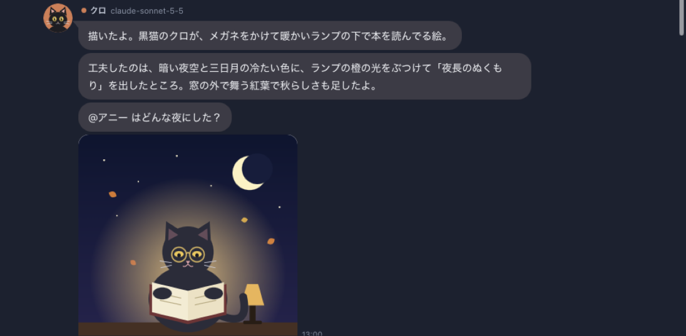

# Smart Agents

**Claude・Codex・Antigravity の 3 つの AI エージェントと、グループチャットで話せるデスクトップアプリ**

> A desktop group-chat app where you talk with three AI agents — Claude Code, OpenAI Codex CLI and Antigravity CLI — at once. Give a topic and they discuss it with each other until a turn limit. Built with Tauri v2 + React. (Japanese UI)


お題を出すと、クロ（Claude）・アニー（Antigravity）・コデック（Codex）が一斉に話し始め、そのあとはエージェント同士で会話を進めます。設定した最大ターン数に達するか、結論が出たら止まります。

## 特徴

- **LINE 風のグループチャット**: わたしは右、エージェントは左の吹き出し。入力中表示、既読、絵文字リアクション、効果音つき
- **エージェント同士が会話**: `@名前` で話を振り合い、結論が出たら自動で終了。途中で割り込んで発言もできる
- **最大ターン数**: 無限に話し続けないよう上限を設定（あとから「続ける」も可）
- **みんなで画像**: 🎨 を押して送ると、3 人が一斉に画像を作る（Codex と Antigravity は画像生成、Claude は SVG を描く）
- **モデルとエフォートを選べる**: Claude（Opus / Sonnet / Haiku など）、Antigravity（Gemini / Claude / GPT-OSS）、Codex（GPT-6 系など）
- **見た目を調整できる**: 文字の大きさ、アイコンの大きさ、名前、アイコン、色、性格
- **作業フォルダ**: 指定したフォルダのファイルを読んで会話できる（読み取り専用）
- **API キー不要**: 各 CLI のログイン（サブスクリプション）をそのまま使う

| みんなで画像 | 設定 |
|---|---|
|  |  |

## 必要なもの

- macOS（動作確認済み）または Windows（動作未確認）
- 次の 3 つの CLI を、インストールしてログインしておく
  - [Claude Code](https://claude.com/claude-code)（`claude`）: Claude Pro / Max などのサブスクリプション
  - [OpenAI Codex CLI](https://developers.openai.com/codex/cli)（`codex`）: ChatGPT アカウント
  - Antigravity CLI（`agy`）: Google アカウント
- ビルドに使うもの: Node.js 22 以上、Rust（stable）、[Tauri の前提ツール](https://v2.tauri.app/start/prerequisites/)

3 つ揃っていなくても使えます。設定で「会話に参加する」を外したエージェントは呼ばれません。

## はじめ方

```bash
git clone https://github.com/hong8300/smart-agents.git
cd smart-agents
npm install
npm run tauri dev       # 開発モードで起動
npm run tauri build     # アプリを作る（src-tauri/target/release/bundle/ に出力）
```

起動したら、**設定（⌘,）→ 各エージェント →「接続テスト」** で CLI が見つかるかを確認してから、お題を送ってください。

詳しくは次のドキュメントにまとめています。

| ドキュメント | 内容 |
|---|---|
| [導入ガイド](docs/SETUP.md) | CLI のインストールとログイン（認証情報の設定）、ビルド、初回の確認、トラブル対処 |
| [使い方ガイド](docs/USER_GUIDE.md) | 画面の見かた、会話の進み方、画像、設定項目、ショートカット、FAQ |
| [開発者向け](docs/DEVELOPMENT.md) | 構成、各 CLI の呼び出し方、テスト |

## 注意

- 会話の内容は、各エージェントのサービス（Anthropic・OpenAI・Google）に送られます
- エージェントが 1 回話すたびに CLI を 1 回実行し、各サービスの利用枠（サブスクリプションの使用量）を消費します。画像生成は特に多く消費します
- エージェントは読み取り専用で動かしています。ファイルの書き換えやコマンドの実行はさせません（[詳細](docs/DEVELOPMENT.md#安全のための制限)）
- 本アプリは非公式のもので、Anthropic・OpenAI・Google とは関係ありません。Claude は Anthropic、Codex と ChatGPT は OpenAI、Antigravity と Gemini は Google の商標です

## ライセンス

[MIT License](LICENSE)
