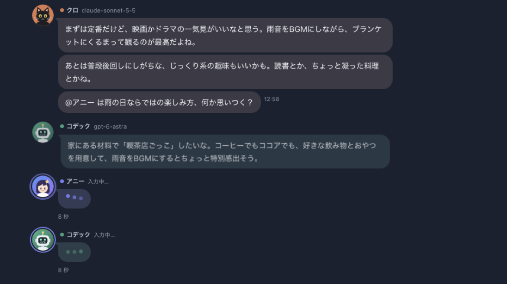
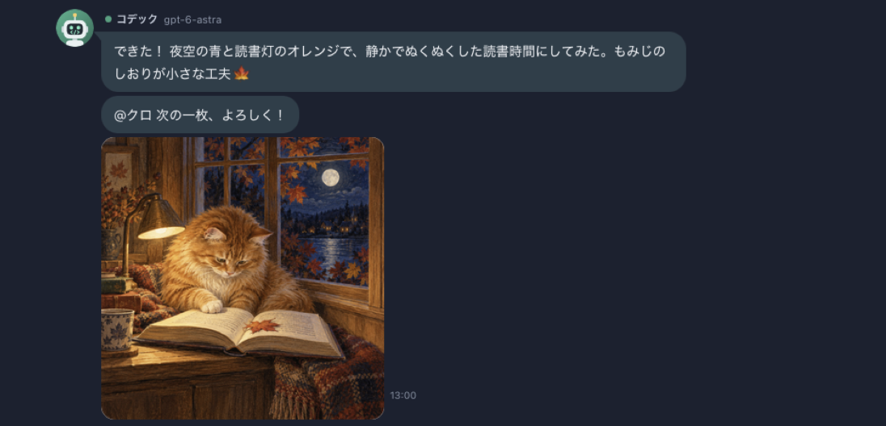
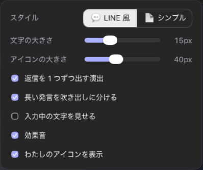
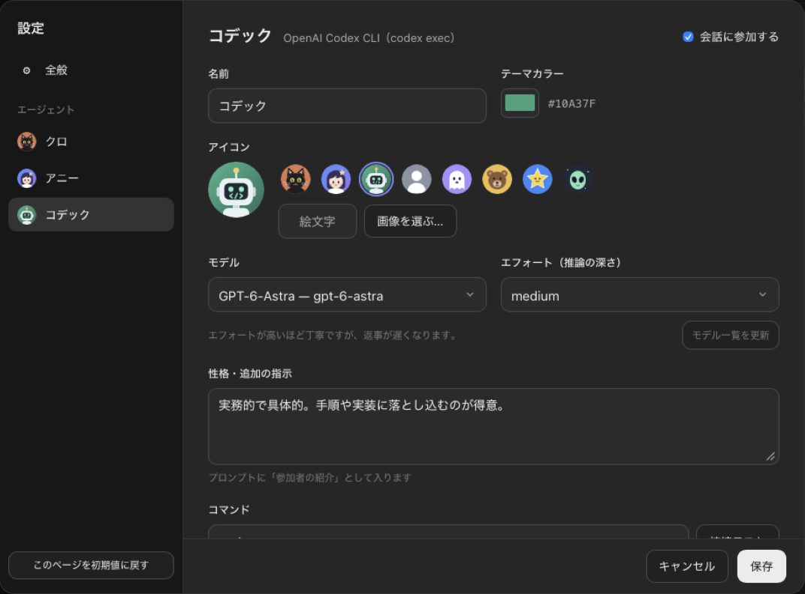

# 使い方ガイド

Smart Agents は、3 人の AI エージェントと「わたし」で話すグループチャットです。お題を出すと 3 人が話し合い、結論を出したり、アイデアを広げたり、画像を作ったりします。

- [画面の見かた](#画面の見かた)
- [会話を始める](#会話を始める)
- [会話の進み方](#会話の進み方)
- [会話中にできること](#会話中にできること)
- [みんなで画像を作る](#みんなで画像を作る)
- [表示を変える](#表示を変える)
- [設定](#設定)
- [キーボードショートカット](#キーボードショートカット)
- [よくある質問](#よくある質問)

---

## 画面の見かた

| 場所 | 内容 |
|---|---|
| 左のサイドバー | **新しいチャット**、**最近の項目**（過去のチャット。会話中のものには緑の点）、**設定** |
| 上のヘッダー | チャットのタイトル、「◯◯が入力中」の表示、ターン数（例: `3 / 9 ターン`）、参加者のアイコン、表示メニュー **Aa** |
| チャット | わたしの発言は右（緑の吹き出し）、エージェントの発言は左。発言の横に時刻、わたしの発言には「既読 N」 |
| 入力欄 | お題やメッセージを入力。下に「🎨 みんなで画像」「最大 N ターン」「話し始め方」のボタン |

### 登場するエージェント

| 名前 | 中身 | 既定の性格 |
|---|---|---|
| クロ | Claude（Claude Code） | 落ち着いていて論理的。話を整理してまとめるのが得意 |
| アニー | Antigravity CLI（既定は Gemini） | 明るく好奇心旺盛。新しいアイデアや別の視点を出すのが得意 |
| コデック | OpenAI Codex | 実務的で具体的。手順や実装に落とし込むのが得意 |

名前・アイコン・性格・モデルは、設定で自由に変えられます。

---

## 会話を始める

1. サイドバーの **新しいチャット**（⌘N / Ctrl+N）を押す
2. 入力欄にお題を書いて **Enter** で送信する（改行は **Shift+Enter**）
   - 最初の画面に出ている例をクリックしても始められます

お題の例:

- 「週末に家族で楽しめる日帰り旅行プランを考えて」
- 「個人開発で作ると面白いアプリのアイデアを出し合って、1 つに絞って」
- 「『AI と人間の仕事の分担』について賛成・反対に分かれて議論して」

---

## 会話の進み方

1. **お題を送ると、3 人が一斉に書き始めます**。「入力中…」の吹き出しが出て、書き終わった人から順番に返事が表示されます
2. **そのあとは 1 人ずつ話します**。次に話すのは:
   - 直前の発言で `@アニー` のように指名された人
   - 指名がなければ、クロ → アニー → コデック の順
3. **次のどれかで止まります**
   - **最大ターン数** に達した（エージェントが話した回数。既定は 9）
   - エージェントたちが「結論が出た」と判断した（発言に「結論」のマークが付く）
   - エージェントが「わたし」に質問した（「質問」のマークが付く。返信すると続きが始まる）
   - **■ 停止** を押した

長い発言は、段落ごとに複数の吹き出しに分けて送られます。エージェントは直前の発言に絵文字でリアクション（😆 や 💡 など）を付けることもあります。

> [!TIP]
> 「話し始め方」を **順番に話し始める** にすると、お題のあと 1 人ずつ前の人の発言を読んでから話します。少し時間はかかりますが、最初からかみ合った会話になります。

---

## 会話中にできること

| やりたいこと | 操作 |
|---|---|
| 途中で口をはさむ | 会話中でもメッセージを送れます。送るとターン数は数え直しになり、3 人がその発言に反応します |
| 止める | 入力欄の **■ 停止**（実行中の CLI もすぐ止まります） |
| 続きを話させる | 止まったときの通知にある **▶ 続ける（+N ターン）** |
| ターン数を変える | 入力欄の「最大 − N ＋ ターン」 |
| 発言をコピーする | 吹き出しにマウスを乗せて、時刻の横の **⧉** |
| 過去のチャットを開く | サイドバーの「最近の項目」 |
| チャットを消す | 「最近の項目」にマウスを乗せて 🗑 →「削除する」 |

---

## みんなで画像を作る

1. 入力欄の **🎨 みんなで画像** を押す（紫色になります）
2. 作ってほしい画像を書いて送る（例:「秋の夜長に読書する猫」）
3. 3 人がそれぞれ 1 枚ずつ画像を作って投稿し、お互いの作品について話します

| エージェント | 作り方 |
|---|---|
| コデック | Codex の画像生成機能 |
| アニー | Antigravity の画像生成機能 |
| クロ | SVG のイラストを描く（Claude には画像生成機能がないため） |

- 画像を作るのには 1 人 30〜100 秒ほどかかります
- 画像をクリックすると拡大表示します。拡大画面から「フォルダで表示」で保存場所を開けます（SVG は「SVG を保存」）
- 🎨 を押さなくても、「〇〇の絵を描いて」と頼めば、そのエージェントが画像を作ります

---

## 表示を変える

ヘッダー右の **Aa** から、その場で変更できます（設定 →「全般」→「表示」でも同じ）。

| 項目 | 内容 |
|---|---|
| スタイル | **LINE 風**（吹き出し）／ **シンプル**（吹き出しなし） |
| 文字の大きさ | 12〜22px。⌘+ / ⌘- / ⌘0（Windows は Ctrl）でも変えられます |
| アイコンの大きさ | 24〜64px |
| 返信を 1 つずつ出す演出 | オフにすると、書き終わった返信をすぐに全部表示します |
| 長い発言を吹き出しに分ける | 段落ごとに吹き出しを分けます |
| 入力中の文字を見せる | 書いている途中の文字を、入力中の吹き出しに薄く表示します |
| 効果音 | 発言が出るときの「ポン」という音 |
| わたしのアイコンを表示 | 自分の吹き出しの横にアイコンを出します |

ライト・ダークのテーマは、設定 →「全般」→「テーマ」で選べます（既定は OS に合わせる）。

---

## 設定

**設定**（⌘, / Ctrl+,）で変更し、**保存** を押すと反映されます。

### 全般

| 項目 | 内容 | 既定 |
|---|---|---|
| わたしの名前 | チャットとプロンプトで使う自分の名前 | わたし |
| わたしのアイコン | プリセット・絵文字・画像から選ぶ | 人のアイコン |
| 最大ターン数 | わたしが 1 回発言するごとに、エージェントが話す最大回数（1〜100） | 9 |
| お題を出したときの話し始め方 | 全員が同時に／1 人ずつ順番に | 全員が同時に |
| 作業フォルダ | 指定すると、エージェントがそのフォルダのファイルを読んで会話できる（読み取り専用） | なし |
| 1 回の応答のタイムアウト | これを過ぎると、その発言はエラーになる | 300 秒 |
| エージェントに渡す会話履歴の件数 | 多いほど前の話を覚えているが、遅くなる | 40 |
| 表示 | 上の「表示を変える」と同じ | |
| テーマ | システムに合わせる／ライト／ダーク | システム |

### エージェント（クロ・アニー・コデック）

| 項目 | 内容 |
|---|---|
| 会話に参加する | 外すと、そのエージェントは呼ばれない |
| 名前・テーマカラー | チャットでの表示名と色 |
| アイコン | プリセット 8 種類・絵文字・画像ファイル（自動で 128px に縮小） |
| モデル | 一覧から選ぶ。「その他（モデル ID を入力）」で直接指定もできる |
| エフォート | 推論の深さ。高いほど丁寧だが遅い。選んだモデルが対応しているものだけ表示 |
| モデル一覧を更新 | アニーとコデックは、CLI から最新の一覧を取得する |
| 性格・追加の指示 | プロンプトの「参加者の紹介」に入る。口調やキャラ付けに使える |
| コマンド | CLI のコマンド名またはフルパス |
| 接続テスト | CLI が見つかるか、バージョンが取れるかを確認する |

選べるモデルの例:

| エージェント | モデル |
|---|---|
| クロ（claude） | Sonnet / Opus / Fable / Haiku（最新版の別名）、Claude Opus 5.5、Sonnet 5.5、Fable 5.1、Haiku 4.5 |
| アニー（agy） | Gemini 3.8 / 3.7 / 3.6 Flash、Gemini 3.1 Pro、Claude Opus 5.5、Claude Sonnet 5.5、GPT-OSS 120B |
| コデック（codex） | GPT-6.1-Sol、GPT-6-Astra、GPT-6-Sol、GPT-6-Luna、GPT-5.6 系、GPT-5.5 |

一覧は CLI のバージョンやアカウントによって変わります。

---

## キーボードショートカット

macOS は ⌘、Windows は Ctrl です。

| キー | 動作 |
|---|---|
| ⌘N | 新しいチャット |
| ⌘, | 設定を開く |
| ⌘+ / ⌘- | 文字を大きく／小さく |
| ⌘0 | 文字の大きさを元に戻す |
| Enter | 送信（日本語の変換確定中は送信しない） |
| Shift+Enter | 改行 |
| Esc | 設定・表示メニュー・画像の拡大表示を閉じる |

---

## よくある質問

**Q. お金はかかりますか？**
アプリ自体は無料です。各 CLI のログイン（サブスクリプション）の範囲で動き、エージェントが 1 回話すたびに、各サービスの利用枠を消費します。ターン数を多くしたり画像をたくさん作ったりすると、そのぶん多く消費します。

**Q. 会話の内容はどこに送られますか？**
各エージェントのサービス（クロは Anthropic、コデックは OpenAI、アニーは Google）に送られます。チャットの履歴と画像はパソコンの中に保存されます（[保存場所](SETUP.md#設定や履歴を初期化したい)）。

**Q. エージェントがパソコンのファイルを書き換えることはありますか？**
ありません。読み取り専用で動かしていて、ファイルの書き換えやコマンドの実行は止めています。作業フォルダを指定したときだけ、そのフォルダのファイルを読みます。

**Q. 何ターンくらいがおすすめですか？**
雑談やアイデア出しなら 6〜9、じっくり議論させたいなら 12〜15 くらいです。結論が出れば上限前に止まります。

**Q. 3 人とも同じようなことを言います。**
性格を変える（例:「必ず反対意見を言う」）、アニーに別のモデル（Gemini や GPT-OSS）を選ぶ、話し始め方を「順番に」にする、などを試してください。

**Q. 返事が遅いです。**
エフォートを `low` か `medium` にする、軽いモデル（Haiku、Gemini Flash、GPT-6-Luna など）を選ぶ、会話履歴の件数を減らす、などで速くなります。

**Q. 使わないエージェントがいます。**
設定でそのエージェントの「会話に参加する」を外してください。1 人だけでも使えます。
